# Diagrams

This document uses Mermaid diagrams. Render in any Markdown viewer that supports Mermaid.

## System context

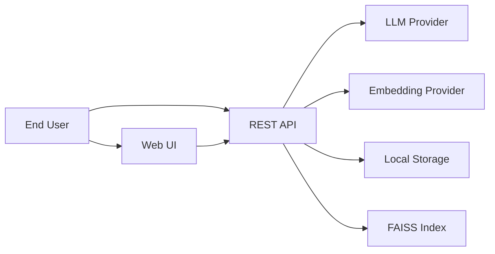

## High-level data flow

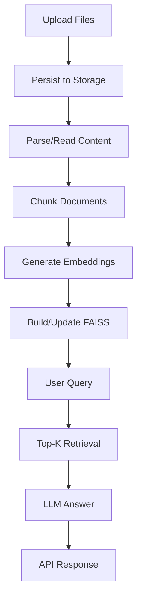

## Analyze flow

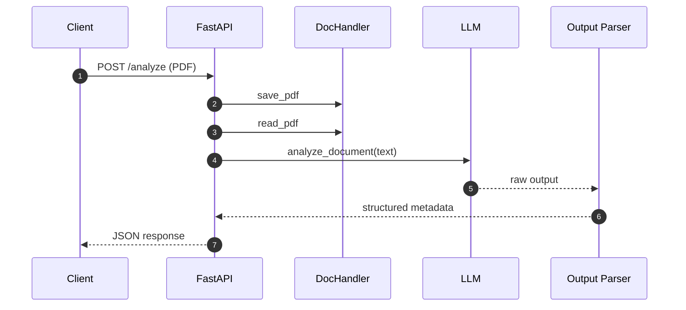

## Compare flow

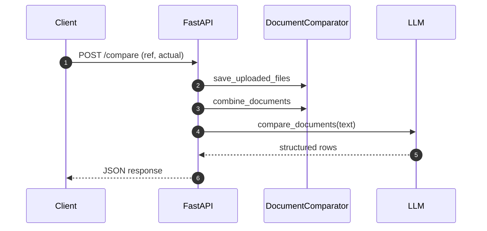

## Chat indexing flow

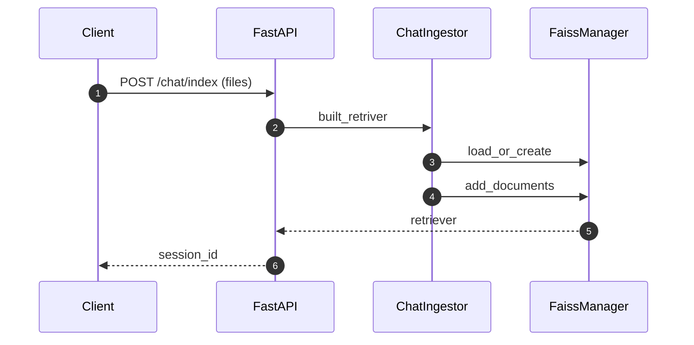

## Chat query flow

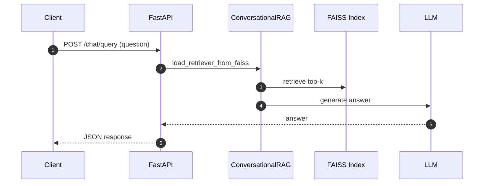

## Deployment diagram

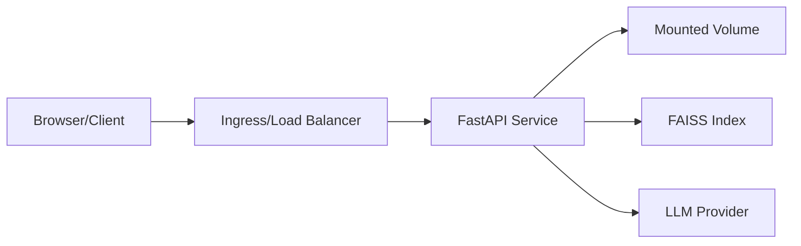

## User journey

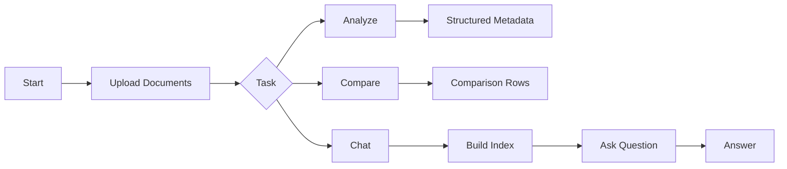

## Component-level sequence diagrams

### DocHandler.save_pdf

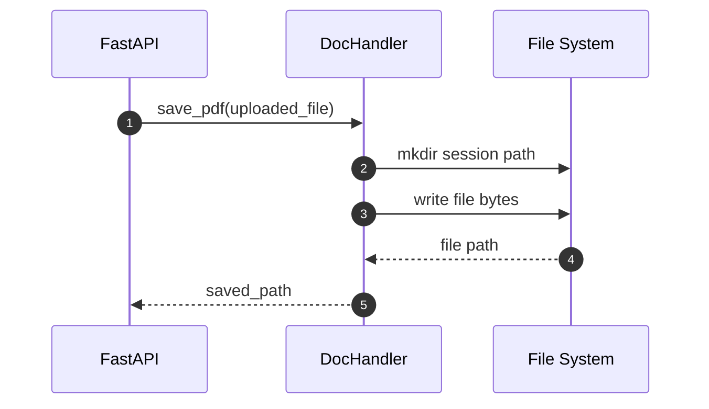

### DocHandler.read_pdf

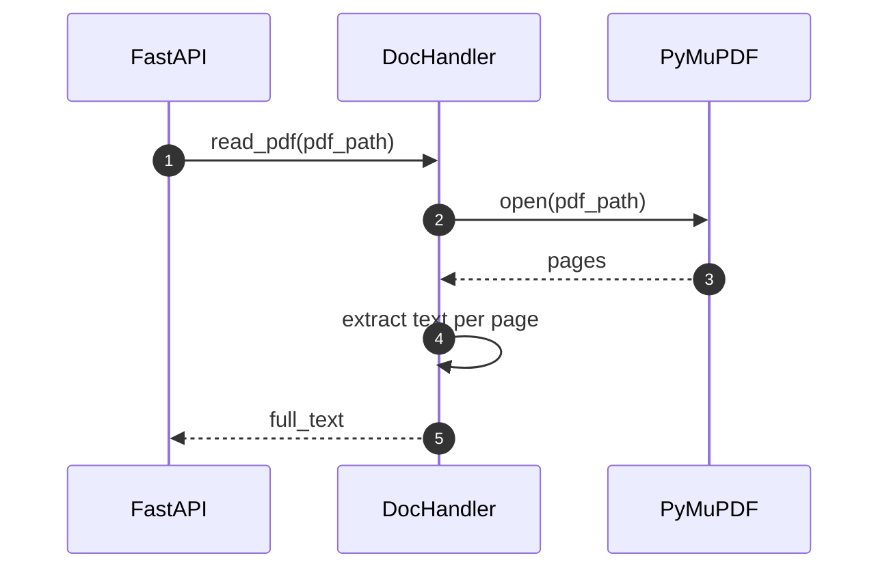

### DocumentAnalyzer.analyze_document

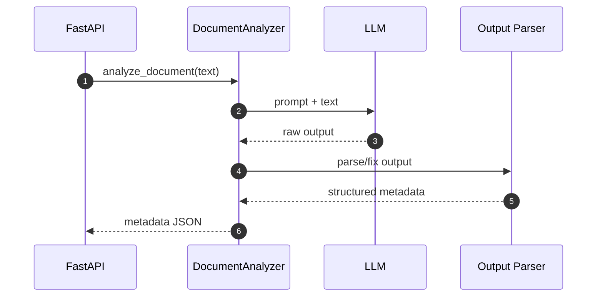

### DocumentComparator.save_uploaded_files

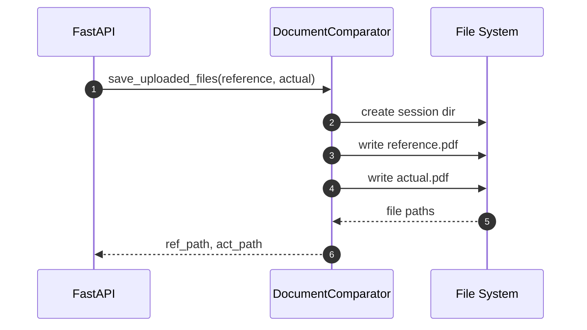

### DocumentComparator.combine_documents

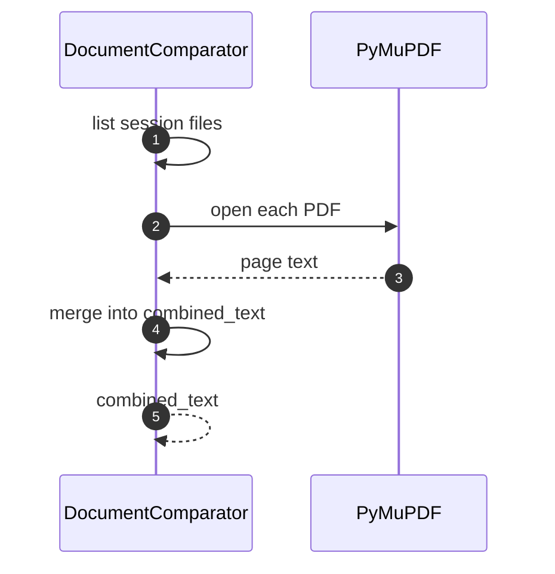

### DocumentComparatorLLM.compare_documents

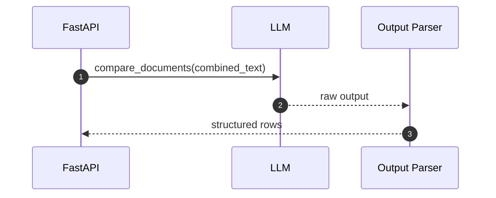

### ChatIngestor.built_retriver

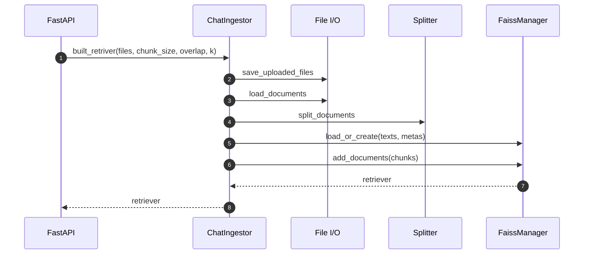

### FaissManager.load_or_create

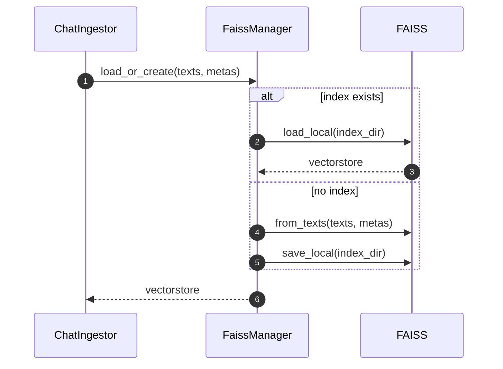

### FaissManager.add_documents

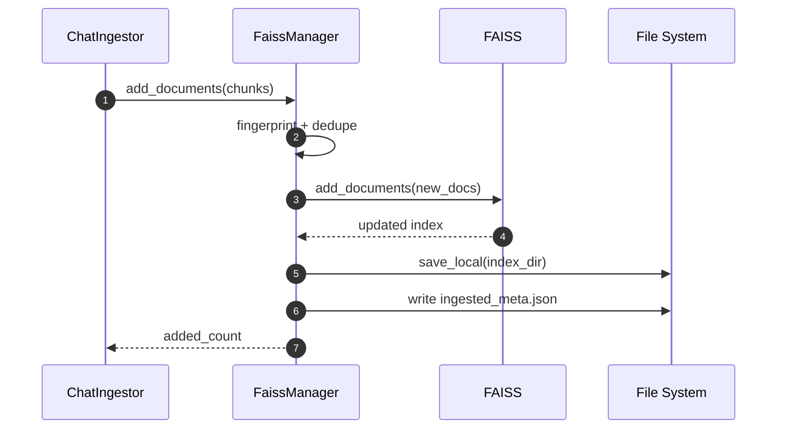

### ConversationalRAG.load_retriever_from_faiss

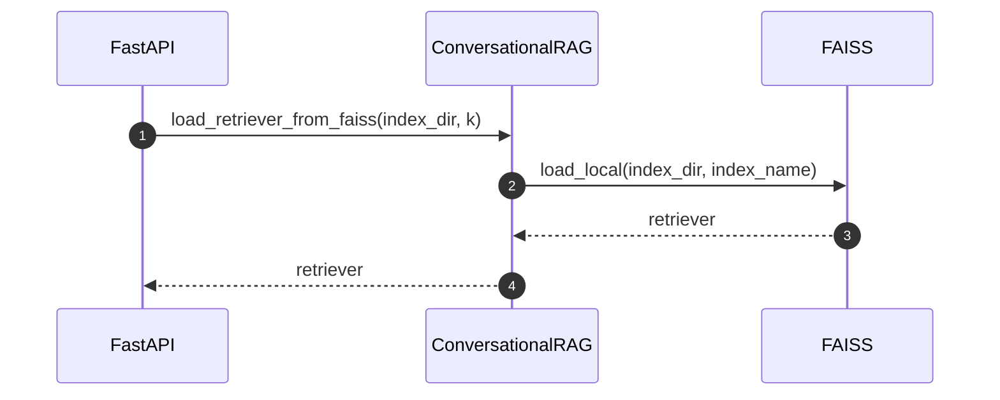

### ConversationalRAG.invoke

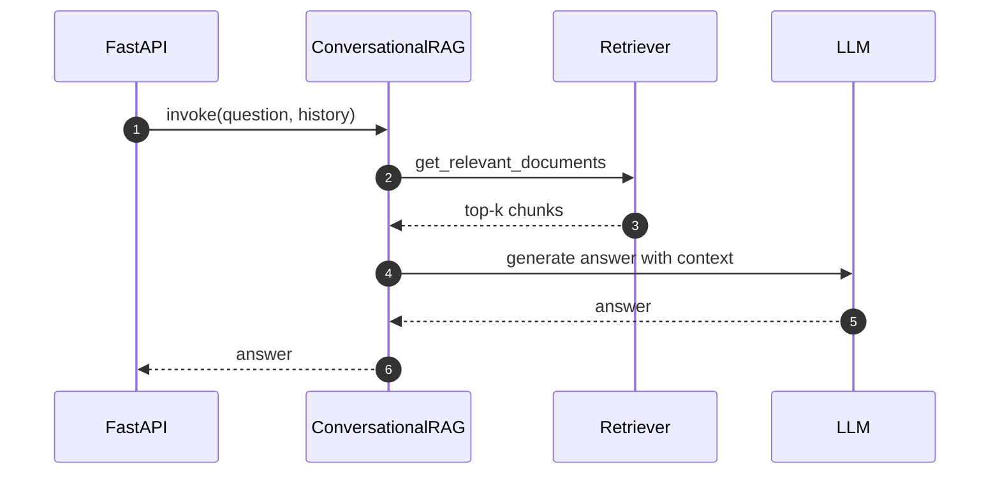

## Threat model and DFD

### Trust boundaries (DFD Level 0)

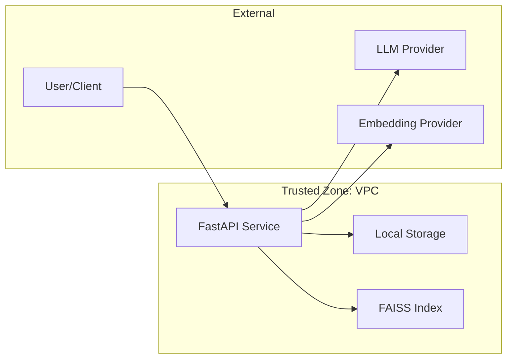

### DFD Level 1

```mermaid
flowchart TD
  User[User] -->|PDFs| API[API Gateway]
  API -->|Persist| Store[(Uploads Storage)]
  API -->|Text| Analyzer[Document Analyzer]
  API -->|Text| Comparator[Document Comparator]
  API -->|Chunks| Ingestor[Chat Ingestor]
  Ingestor -->|Embeddings| Embedder[Embedding Provider]
  Ingestor -->|Index| FAISS[(FAISS Index)]
  API -->|Query| Retriever[Conversational RAG]
  Retriever -->|Top-K| FAISS
  Analyzer -->|Prompt| LLM[LLM Provider]
  Comparator -->|Prompt| LLM
  Retriever -->|Prompt| LLM
  API -->|JSON| User
```

### STRIDE threats (summary)

```mermaid
flowchart TB
  S[spoofing] --> S1[unauthenticated API access]
  T[tampering] --> T1[file upload manipulation]
  R[repudiation] --> R1[missing audit logs]
  I[information disclosure] --> I1[PII in logs or prompts]
  D[denial of service] --> D1[large file uploads]
  E[elevation of privilege] --> E1[overly permissive CORS]
```

## Infra diagram (ECS/VPC)

```mermaid
flowchart LR
  Internet[Internet] --> IGW[Internet Gateway]
  IGW --> ALB[Application Load Balancer]

  subgraph VPC[VPC]
    subgraph Public[Public Subnets]
      ALB
      NAT[NAT Gateway]
    end
    subgraph Private[Private Subnets]
      ECS[ECS Service]
      Task[ECS Task: FastAPI]
      ECS --> Task
    end
    ALB --> ECS
  end

  Task --> ECR[ECR Image]
  Task --> SM[Secrets Manager]
  Task --> CW[CloudWatch Logs]
  Task --> FS[Mounted Volume]
```
